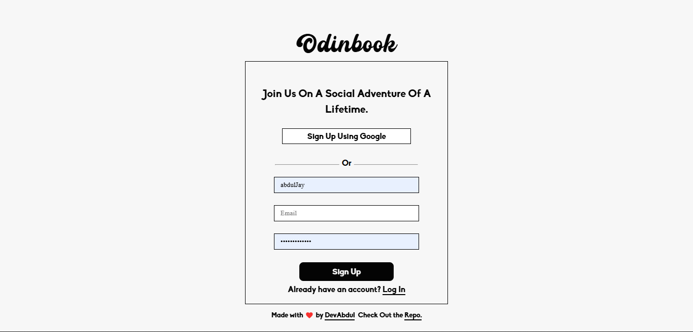
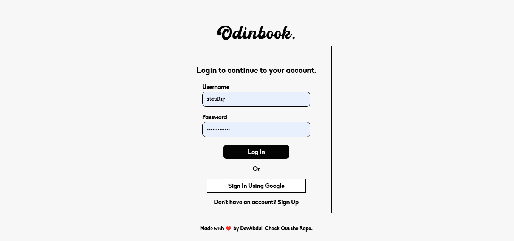

# Odinbook 
This is my implementation of The Odin Project's Odinbook Project.

* Sign Up Page:

* Log In Page:

* Home Page:

* Profile Page:

## Details
This project is a decoupled frontend + backend project that uses react on the frontend and express on the backend. This repo is for the frontend part, tools and libraries used include react-router, socket.io-client, framer-motion, date-fns, lucide-react, react-hook-form, sonner, e.t.c. 

## Stuff learned and Improved

* Real-time data fetching - This is the very first project i've built using socket.io for real-time data fetching. It is also my first implementation of real time data fetching, it hasn't been easy, but it greatly helped me improve my real time data fetching skills in a react environment.

* Data fetching - This project greatly helped me improve my data fetching skills in a react environment.

* Session Handling - This project greatly helped my improve utilizing cookies in a react decoupled project to handle sessions. It was really an enlightening experience.

* Authentication - This isn't my first decoupled project using react that fully utilizes passportJS to handle authentication, but it's the first that utilizes a third party Oauth service (in this case Google) as an alternative auth option. I learnt alot from this.

## Features

Features of Odinbook Include:-

* Sleek and minimalistic UI - I've taken the time to craft a sleek yet minimalistic UI for Odinbook that's easy on the eyes while also being aesthetically pleasing. The UI is 100% mobile responsive and features upto five different themes!.

* Sign Up / Log In - Odinbook features beautiful and functioning sign up and log in pages.

* User Profiles - Odinbook features a simple profile page that displays relevant user data along with a log out button, an edit button as well as  a button for managing themes.

* Posts - Odinbook has a post feature that allows users to craft posts of upto 350 characters in length. It also allows users to attach images to their posts.Odinbook also provides all CRUD functionality for posts. 

* Comments - Odinbook has a Comments feature that allows users to craft and send comments under a post. Odinbook also provides all CRUD functionality for comments.

* Friends - Users can send friend request to other users as well as accept, reject and review friend requests from other users. 